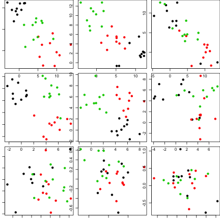
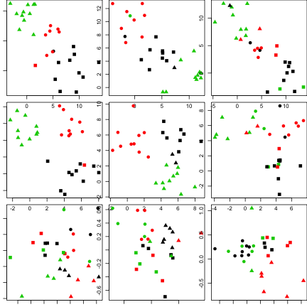
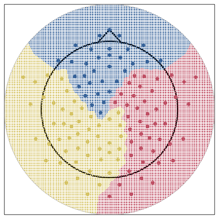

# Introduction to MIC2 Package

`MIC2`<sup>[1](#myfootnote1)</sup>
is a R package performing Multilevel Integrative Clustering, which allows for integrating information
over multiple heterogeneous sources to facilitate group level inference. It was originally developed to cluster (partition)
electroencephalogram (EEG) electrodes (equivalently patches of scalp they are attached to) based on the recorded signals and features, 
but can be easily generalized to accommodate to various scientific contexts. This introduction will demonstrate the full functionality 
of the `MIC2` package, using examples from simple 2-D gaussian mixtures, that can be discerned visually, to simulated EEG signals, 
and more importantly, the workflow to implement `MIC` accordingly.
For more of its details, please refer to our manuscipt [here](https://arxiv.org/abs/1609.09532).

## Installation

```r
devtools::install_github("Qian-Li/MIC2")    ## to install
library(MIC2)                               ## to load
```
This vignette is locally available with an extra option: `devtools::install_github("Qian-Li/MIC2", build_vignettes = T)` when
installing the package. To view it, `utils::vignette('MIC2-intro')`. Please re-install the package with the `build_vignettes` option
on if having touble openning it.

## Gaussian Mixtures

In this example, we simulate a group of 3 subjects, each with 3 repeated measurements collected on 30 items, 10 per group,
that were simulated from a 2-D gaussian mixture distribution. The correct partition on 30 items is unclear at a particular
measurement, however, the idea is to integrate information across repetitions by the proximity between 30 items, 
and across individuals for an optimal group level partition. As shown below, the simulated data for 3 subjects (in rows) on 3 repeated
measurements (in columns) is colored by their true group labels.



To figure out the optimal label at all levels, i.e. group individual and repetitions, `MIC` admits data as a list of 3-D arrays,
whose components are repeated measurements stacked in the 3rd dimension and items in the 2nd dimension, for each individual.
Please refer to `help(MIC_prep)` and `help(MIC)` for data preparation.


```r
## -- Model fitting for 3 clusters, 10000 MCMC samples
MIC(list_dat, K = 3, nit = 10000) -> out
```

```r
## -- Optimal group labels:
out$clustS
```

```
##  [1] 3 3 3 3 3 3 3 3 3 3 1 1 1 1 1 1 1 1 1 1 2 2 2 2 2 2 2 2 2 2
```

```r
## -- individual coherence to the group
out$alpha
```

```
##           mean    lo.ci   median    up.ci
## sub1 0.7852595 0.430350 0.827475 0.981877
## sub2 0.7671930 0.431111 0.801806 0.975535
## sub3 0.4783365 0.345603 0.459441 0.676453
```



By scattering the original data, points are colored according to the `MIC` optimal individual level labels, but their shapes
are determined by the optimal repetition level labels. The coherence parameter indicates the proximity between
individual labels and group estimates, meanwhile, reflecting its contribution to the group inference. Since 
subject (in row) 1 and 2 has more separable patterns that are highly coherent with the group level, 
the corresponding $\alpha$ estimates are much higher than that of subject3.

## EEG simulation and workflow
Details regarding the signal generation are expatiated in our manuscript and its supplementary document. Here, we
only demonstrate the workflow of dealing with EEG signals, using simulated data. 

### Simulated signals

```r
set.seed(123)
## -- 20 segments of signals sampled at 200Hz frequency, for 5 highly coherent individuals
sim <- MIC_sim(alpha = 0.9,  nsub = 5, fs = 200, segs = 20)
```

### Optimal Model: number of clusters

```r
## -- optimal model search, with a smoothing setting of window = 4, overlap of 2.(takes approx 3mins)
out <- dk_search(sim$Data, max_d = 10, n.iter = 5000, par.win = c(4, 2))
## ## -- search log -- ##
## ----------------------------------------- 
## D = 2: best_K = 3 COH = 0.8568124
## ----------------------------------------- 
## D = 3: best_K = 4 COH = 0.8476597
## ----------------------------------------- 
## D = 4: best_K = 4 COH = 0.8485574
## ----------------------------------------- 
```
Our searchign algorithm suggested the optimal model to investigate is 4 cluster mixture, the same as the simulation truth, 
and it converged at the $d = 4$. We would proceed with these settings, including the smoothing and spectral estimate parameters.

### Model fitting:

```r
## -- Spectral Estimation and Eigen-Laplacian transformation
list_data <- lapply(sim$Data, function(x) MIC_prep(X = x, d = 4,
                                  par.spec = c(80, 50, 100), par.win = c(3, 1)))
## -- Model fitting (takes approx 17secs)
output <- MIC(data = list_data, K = 4, nit = 5000)
```

#### Results assessment:

```r
## -- Realign estimated labels against truth
est_S = align(refL = sim$C, L = output$clustS)
n     = length(sim$Data)
est_C = lapply(1:n, function(i) output$clustC[i,] = align(refL = est_S, L = output$clustC[i,]))
tru_C = lapply(1:n, function(i) sim$Ci[,i])
```


```r
## -- Group label accuracy:
sum(est_S == sim$C) / length(est_S)
```

```
## [1] 1
```

```r
## -- Individual labels accuracy:
mapply(function(x,y) sum(align(refL = x, L = y) == x)/length(est_S), tru_C, est_C)
```

```
## [1] 1 1 1 1 1
```

### More functionalities:

Here we briefly examplify the usage of `EEGplot`, which plots out the the 1st-124th electrode of 
128 channel HydroCel Geodesic Sensor Net on its [map](ftp://ftp.egi.com/pub/support/Documents/net_layouts/hcgsn_128.pdf).
The 125th-129th electrodes were excluded in this plot, and the label estimates are faked (1-32, 33-80, 81-124).


```r
par(oma = rep(0,4), mar = rep(0.5,4)); EEGplot(clust = label, color = colors)
```



<a name="myfootnote1">1</a>: The first version of `MIC` is implemented in basic R, whereas the current version used `Rcpp` that yields a 40+ times efficiency boost.
